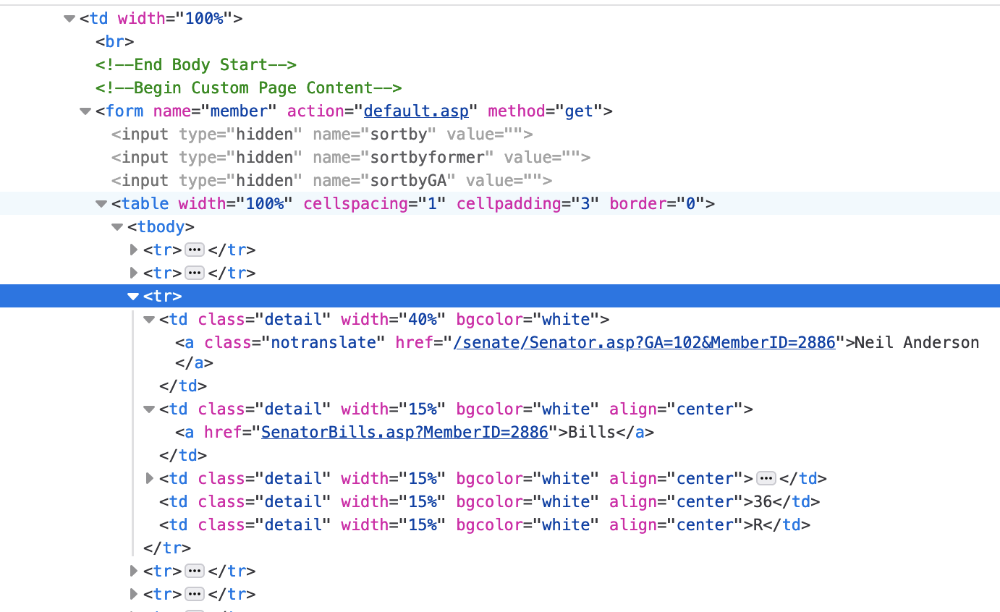
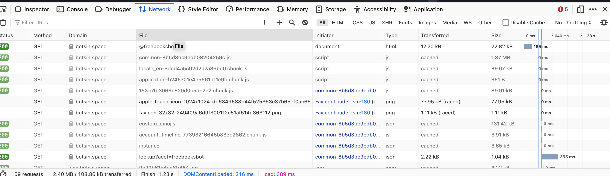
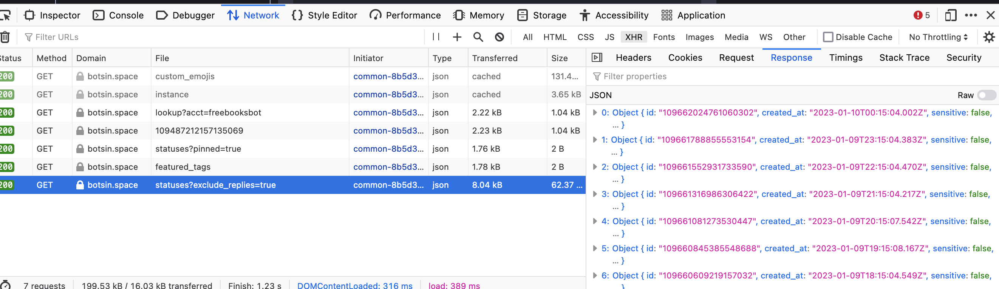

# Module 2 Lab

This lab contains a few practice problems to help you get practice working with gathering data.

In this lab, you will be working to extract information from real HTML pages.

## Instructions

1. From within the `m2` directory, run `poetry install` to install the dependencies.
2. You can run individual files with `poetry run python m2lab/<filename>.py` or `poetry run python -m m2lab.filename`.

## Problem 1 - FEC Filings

### Step 1) Explore the page

Open <https://www.fec.gov/data/candidate/P80003338/>.  This is an FEC filing page for the 2012 Obama campaign.

We want to build a simple tool that given a candidate ID like `P80003338` will print out the total amount of money raised by that candidate.

To do this, we need to extract two pieces of information, the candidate's name **"OBAMA, BARACK"** and the total amount raised **"$742,601,913.88"**.

Open up the web inspector and look at the page source, the candidate name appears in its own element:

```html
<h1 class="entity__name">OBAMA, BARACK</h1>
```

This is our lucky day, nicely labeled data? We can use this to extract the name.

When we look at the total amount, we see we aren't quite as lucky:

```html
<tr class="simple-table__row level--1">
  <td class="simple-table__cell">
    <span class="term" data-term="total receipts" title="Click to define" tabindex="0">Total receipts</span>
  </td>
  <td class="simple-table__cell t-mono">
    $742,601,913.88
  </td>
</tr>
```

The classes on the cells are not as unique.  We can however take advantage of the fact that the `level--1` class is only used on the row containing the total amount.

### Step 2) Experiment in the REPL

Open a REPL with `poetry run ipython -i m2lab/fec.py P80003338`.

You will have a variable `root` that contains the parsed HTML.

Using what you saw above, try selecting the candidate name and total amount raised.

### Step 3) Update `fec.py`

When you have working selection code you can update `fec.py` to print out the candidate name and total amount raised by filling in the code in the `main` block.

### Step 4) Run the script

Try running the script with `poetry run python m2lab/fec.py P80003338` and see if it works.

You can try other candidates by changing the ID in the URL and running the script again.

* P00003335 - George W. Bush
* P80000722 - Joe Biden

You will see that the script works for some candidates but not others.
For instance, try:

* P80001571 - Donald Trump

Your script will likely error out, there is no total amount on this page since it is defaulting to 2024.

If you explore the site, you'll see that <https://www.fec.gov/data/candidate/P80001571/?cycle=2020> looks like what you want.

If you'd like to update the script to handle this, you are encouraged to try to do so.  Consider adding a new command line argument to specify the cycle.

## Problem 2 - NPR Headlines

### Step 1) Find a page to scrape

Let's say we want to scrape the latest headlines from NPR so that we can automatically monitor the news for topics related to our research.

We look at <https://www.npr.org/> and see that headlines are all shapes and sizes, formatted to be visually appealing.

While it'd be possible to scrape this, we get a tip that when the [EU GDPR](https://en.wikipedia.org/wiki/General_Data_Protection_Regulation) regulations passed, some news sites introduced very simple text-only versions of their sites that do not include any ads or tracking.

A search for "npr simple homepage" brings us to <https://text.npr.org/>.  This page is much simpler, if we view source we see that it is just a list of anchor tags:

```html
<ul>
    <li><a class="topic-title" href="/1147095204">As Damar Hamlin shows 'substantial improvement,' Buffalo Bills will play Sunday</a></li>
    <li><a class="topic-title" href="/1147157065">Sony says its PlayStation 5 shortage is finally over, but it's still hard to buy</a></li>
    <li><a class="topic-title" href="/1147102968">'Pineapple express' storm brings more floods and topples trees in California</a></li>
    <li><a class="topic-title" href="/1147224361">Peloton agrees to pay a $19 million fine for delay in disclosing treadmill defects</a></li>
    <li><a class="topic-title" href="/1146841362">The House last struggled to elect a speaker 100 years ago. Here's what happened</a></li>
    <li><a class="topic-title" href="/1144110063">This decluttering philosophy can help you keep your home organized</a></li>
    <li><a class="topic-title" href="/1147112440">Investigators reveal new information they say ties Idaho killings to Bryan Kohberger</a></li>
    ...
</ul>
```

### Step 2) Experiment in the REPL

Open a REPL with `poetry run ipython -i m2lab/npr.py`.
You will have a variable `root` that contains the parsed HTML.

Try selecting the headlines with `root.cssselect('a')` and see what you get.  (You might want to iterate over this list and print out the `text_content()` of each anchor tag.)

You should see that you get a list of all the anchor tags on the page, not just the headlines.
Consider how you might adjust your selector to only get the headlines.
Is there anything that they all have in common that the other links on the page don't?

### Step 3) Update `npr.py`

Open the file `m2lab/npr.py` and complete a script that extracts the headlines from the page.

## Problem 3 - List of Senators

For this problem, you will be scraping data from the Illinois General Assembly website (<https://ilga.gov>).

The file `data/ilga.html` is a snapshot of `https://ilga.gov/senate/`.

We will use this file to practice scraping data from the website.

### Step 1) Inspect the page

Open the file in your web browser and either view source or inspect the page as discussed in the lecture.

You should see that the list of senators is contained in a `<table>` element, here is a screenshot from my web inspector:



We want to extract each Senator's name.

### Step 2) Experiment in the REPL

Open a REPL with `poetry run ipython -i m2lab/ilga.py`.
You will again have a variable `root` that contains the parsed HTML.

You can use the methods of the `root` object to explore the HTML and find the data you want.

There are a few paths you could take to extract this data:

* The `<table>` element has a width of '490', which seems unique enough to use as a selector.
  * Once you have the table, you can select the rows (`<tr>`) and for each row select the name from within the first `<td>` element.
  * It is possible you'll get some extra data from the header rows, that's usually fine, you can clean that up later or add a conditional to skip those rows.
* It is also apparent that the Senator names are in `<a>` elements with a class of "notranslate", you could use that as a selector.
  * Once you have the `<a>` elements, you can extract the text from each one.
* The `<td>` elements have a width of '40%' that sets them apart from their neighbors. That'd also be another way to get to the names.

Ultimately there's no one right way to do this, experimentation is often key to finding the selector that yields something as close as possible to the data you want.  You may decide it is easier to over-select and then clean up the data later, or opt for tighter selectors instead.

### Step 3) Finish `ilga.py`

Once that you have selector(s) that work, update the code at the bottom of `ilga.py` to return a list of the names of the senators.

### Extra Practice

Instead of just printing the names, let's consider having our code create a dictionary-per-Senator where each dictionary has the keys `name`, `district`, and `party`.

You'll see that those values are in the neighboring `<td>` elements, so you'll need to extract those as well.

(**Note**: This is more challenging, so don't worry if you don't get it done.  It's a good exercise to try to figure out how to do it though.  It is also worth considering how this requirement might change your approach. It may be easier to use the `<tr>` method instead of the `<a>` method for instance, since once you have the row it is easier to get the child `<td>`s.)

## Problem 4 - Social Media

For this problem, we're going to take a look at the account `https://botsin.space/@freebooksbot` as an example of what it'd take to scrape data from a modern page like a social media account.

### Step 1) Inspect the page

Visit <https://botsin.space/@freebooksbot> and view source.

If you view source in your browser, you'll notice the HTML is surprisingly short.  You'll also see that `view-source` doesn't show the full HTML, it only shows the HTML that was loaded when the page was first loaded.

This is because the page is dynamically loading content, to scrape this page we need to intercept that content!

### Step 2) Use the Network Tab

Open the Network tab in your web inspector and refresh the page.

You should see a bunch of requests, some of which are for HTML, some for CSS, and some for JavaScript.

Click any of these, and you'll have the ability to see the response data.



Click "XHR" to limit the requests to just the ones that are loading data.

You'll see a request that looks like `statuses?exclude_replies=true` -- that sounds promising!

Click on it and you'll see the response data is a bunch of JSON.



We can right click on the request and copy the URL, which gives us <https://botsin.space/api/v1/accounts/109487212157135069/statuses?exclude_replies=true>.

Loading that URL will give you the JSON data.

### Step 3) Make a direct request

Using requests, we can make a direct request to that URL and get the JSON data.

This time we don't provide a template file, but you can write your own `mastodon.py` based upon the prior examples.

Try writing a script that outputs the 5 most recent statuses from the account.

Once the data is loaded, you can extract data from the "content" key of each status.  You'll notice they're actually returning formatted HTML inside this JSON.  If you wanted to extract more data from each status, you could parse this fragment of HTML as well.  For this lab though, we are done.

### Extra Practice

What would it take to alter this so that it takes a command line argument that is a user ID (like 109487212157135069 from the above example?) and then prints out the statuses for that user?

What if you wanted it to take a human-readable name like "freebooksbot"?

## Conclusion

Congratulations on completing some real-world applications of web scraping. Notice that in the final case, we stumbled onto an internal API. JavaScript-based pages can be difficult to parse, but it is often (but unfortunately not always) possible to find the data you want by inspecting the network requests.
